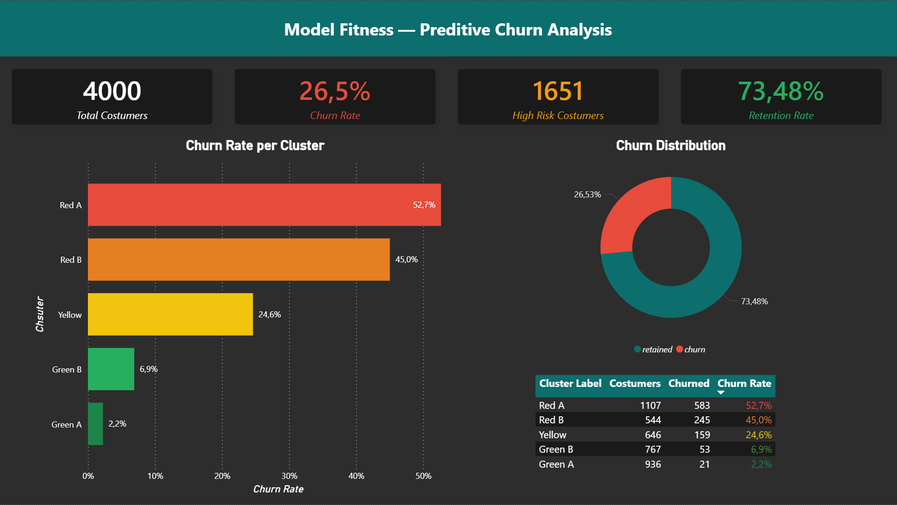
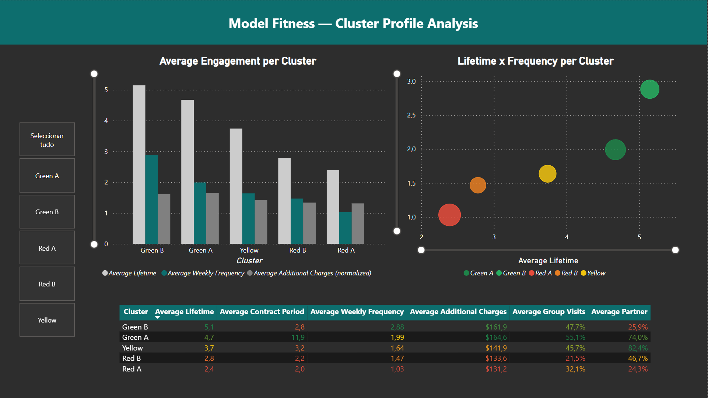
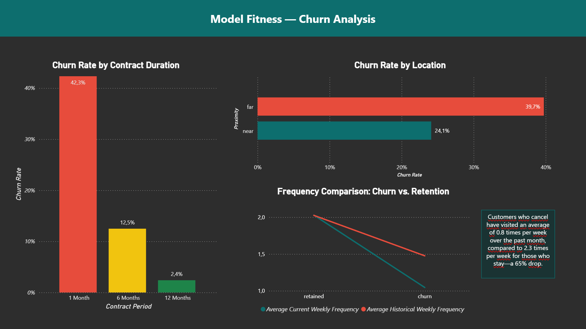
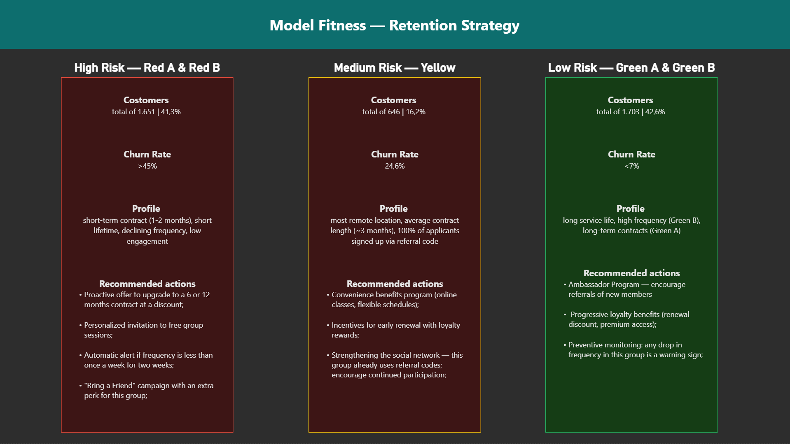

# Model Fitness — Churn Prediction & Retention Strategy

A end-to-end data analysis project predicting customer churn for the **Model Fitness** gym chain, combining predictive modeling, behavioral segmentation, and a Power BI dashboard to support data-driven retention decisions.

> **Core question:** Who is leaving next month — and what can we do before that happens?

---

## 📊 Dashboard Preview

| Executive Overview | Cluster Profile |
|---|---|
|  |  |

| Churn Analysis | Retention Strategy |
|---|---|
|  |  |

---

## 🔍 Project Overview

The analysis covers **4,000 gym members** and addresses four main questions:

1. Which behavioral and contractual features best predict churn?
2. How do classification models compare in detecting at-risk customers?
3. What distinct behavioral profiles exist in the customer base?
4. What retention actions are appropriate for each profile?

---

## 📁 Repository Structure

```
tt13_gym_project/
│
├── data/
│   ├── raw/
│   │   └── gym_churn_us.csv           # Original dataset — never modified
│   └── processed/
│       └── gym_churn_clusters.csv     # Exported after clustering (with cluster labels)
│
├── notebook/
│   └── tt13_gym_project.ipynb         # Full analysis notebook
│
├── report/
│   ├── gym_churn_dashboard.pbix       # Power BI dashboard (requires Power BI Desktop)
│   ├── gym_churn_dashboard.pdf        # Exported PDF — no software required
│   └── screenshots/
│       ├── p1_executive_overview.png
│       ├── p2_cluster_profile.png
│       ├── p3_churn_analysis.png
│       └── p4_retention_strategy.png
│
├── .gitignore
├── README.md
└── requirements.txt
```

---

## 📂 Dataset

**Source:** `data/raw/gym_churn_us.csv` — 4,000 records, 14 features + 1 target variable.

**Target variable:**
- `churn` — 1 = churned; 0 = retained

**Features:**

| Group | Variables |
|---|---|
| Profile | `gender`, `age`, `near_location`, `partner`, `promo_friends`, `phone` |
| Contract | `contract_period`, `month_to_end_contract` |
| Behavior | `lifetime`, `group_visits`, `avg_class_frequency_total`, `avg_class_frequency_current_month`, `avg_additional_charges_total` |

---

## ⚙️ Methodology

### 1 — Data Preparation
- No missing values found
- Type validation and duplicate check
- Descriptive statistics with `describe()`
- Global configuration: `RANDOM_STATE = 42`, standardized display options

### 2 — Exploratory Data Analysis (EDA)
- Descriptive statistics grouped by churn status
- Distribution comparison (histplot + KDE) for continuous variables
- Bar charts for binary features by churn group
- Correlation heatmap (`numeric_only=True`)

### 3 — Churn Prediction Models
- `train_test_split` — 80% train / 20% test, `random_state=42`
- `StandardScaler` applied to both models on the same scaled data
- Two classifiers compared: Logistic Regression and Random Forest

### 4 — Customer Segmentation
- Features standardized with `StandardScaler` (target variable excluded)
- Hierarchical clustering (dendrogram) to estimate optimal cluster count
- K-Means with `n_clusters=5`, `n_init=10`, `random_state=42`
- Cluster profiles analyzed by mean features and churn rate

---

## 🤖 Model Results

| Metric | Logistic Regression | Random Forest |
|---|---|---|
| Accuracy | **0.92** | 0.91 |
| Precision | **0.87** | 0.85 |
| Recall | 0.78 | 0.78 |
| F1 Score | **0.83** | 0.81 |
| ROC-AUC | **0.97** | 0.96 |

**Logistic Regression outperformed Random Forest across all metrics** in this dataset, achieving a ROC-AUC of 0.97. In churn problems, Recall is particularly critical — both models detected 78% of customers who actually churned.

---

## 👥 Customer Segmentation — 5 Clusters

| Cluster | Customers | Churn Rate | Profile |
|---|---|---|---|
| 🔴 Red A | 1,107 | **52.7%** | Short contract (≈2 months), low lifetime, very low frequency, minimal engagement |
| 🔴 Red B | 544 | **45.0%** | Short contract, no nearby location, low frequency, moderate partner rate |
| 🟡 Yellow | 646 | **24.6%** | Remote location, avg. 3-month contract, 100% signed via referral code |
| 🟢 Green B | 767 | **6.9%** | High frequency (2.88×/week), long lifetime, low referral and partner rate |
| 🟢 Green A | 936 | **2.2%** | Long-term contracts (≈12 months), high spending, strong partner rate (74%) |

**1,651 customers (41.3% of the base) are in high-risk clusters (Red A + Red B).**

---

## 🔑 Key Findings

**Contract duration is the strongest predictor of churn:**
- 1-month contracts: **42.3% churn rate**
- 6-month contracts: **12.5% churn rate**
- 12-month contracts: **2.4% churn rate**

**Current frequency signals imminent churn:**
Customers who churn visit an average of **0.8×/week** in their final month, versus **2.3×/week** for those who stay — a 65% drop.

**Proximity matters:**
Customers far from the gym churn at **39.7%**, compared to **24.1%** for those nearby.

---

## 🎯 Retention Strategy

### 🔴 High Risk (Red A & Red B) — 1,651 customers
- Proactive offer to upgrade to 6 or 12-month contracts at a discount
- Personalized invitation to free group sessions
- Automatic alert if frequency drops below 1×/week for two consecutive weeks
- "Bring a Friend" campaign with an extra perk for this group

### 🟡 Medium Risk (Yellow) — 646 customers
- Convenience benefits program (online classes, flexible schedules)
- Early renewal incentives with loyalty rewards
- Strengthen social network — this group is 100% referral-based; encourage continued participation

### 🟢 Low Risk (Green A & Green B) — 1,703 customers
- Ambassador program — encourage referrals of new members
- Progressive loyalty benefits (renewal discount, premium access)
- Preventive monitoring: any frequency drop in this group is an early warning signal

---

## 🛠️ Tech Stack

| Tool | Purpose |
|---|---|
| Python 3.11 | Core language |
| pandas 3.0.1 | Data manipulation |
| numpy 2.4.2 | Numerical computing |
| scikit-learn 1.8.0 | Modeling and clustering |
| matplotlib 3.10.8 | Visualization |
| seaborn 0.13.2 | Statistical plots |
| Power BI Desktop | Interactive dashboard |

---

## ▶️ How to Run

**1 — Clone the repository:**
```bash
git clone https://github.com/rodriguesbrian/tt13_gym_project
cd tt13_gym_project
```

**2 — Create and activate the environment:**
```bash
conda create -n gym_project python=3.11
conda activate gym_project
pip install -r requirements.txt
```

**3 — Launch the notebook:**
```bash
jupyter notebook notebook/tt13_gym_project.ipynb
```

**4 — View the dashboard:**

Open `report/gym_churn_dashboard.pbix` in Power BI Desktop, or open `report/gym_churn_dashboard.pdf` directly — no software required.

---

## 📋 Requirements

```
pandas==3.0.1
numpy==2.4.2
scikit-learn==1.8.0
matplotlib==3.10.8
seaborn==0.13.2
jupyter
```

---

*Project developed as part of the TripleTen Data Analyst Bootcamp — Module 13.*
